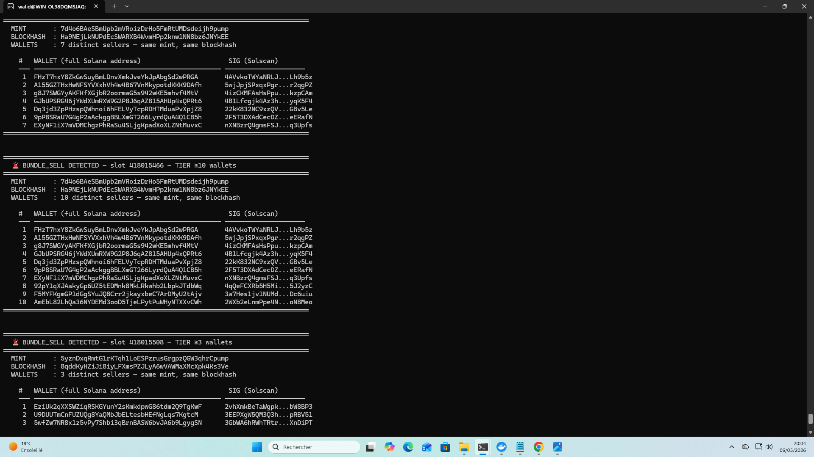
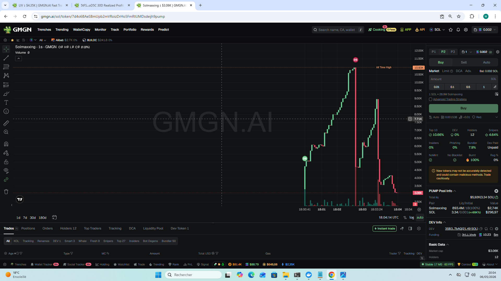
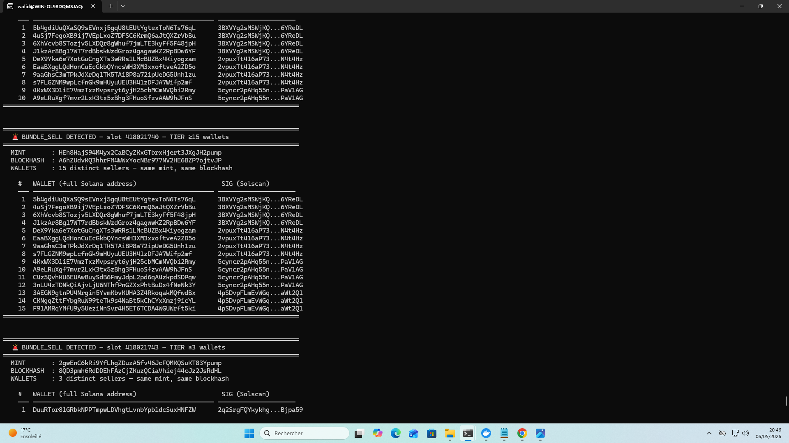
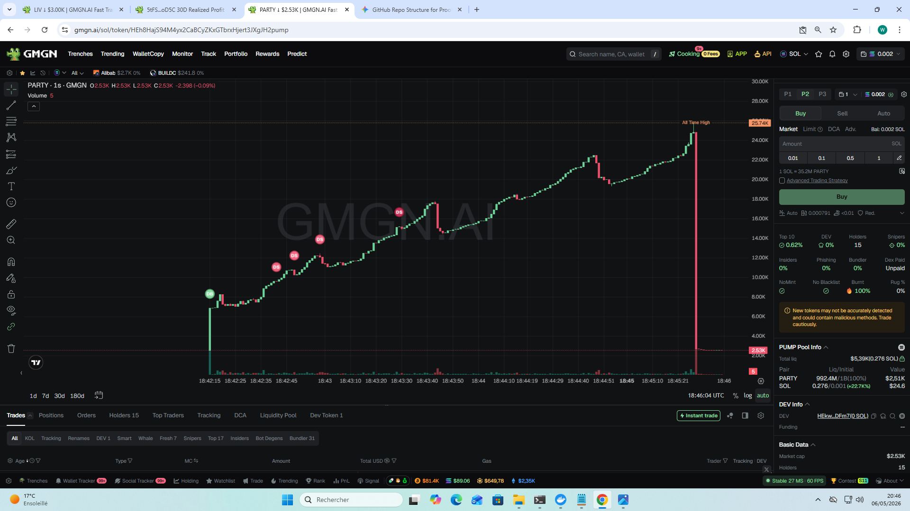

# Brain-Shield — Layer 2 : Coordinated Dump Detection

**Real-time detection of multi-wallet coordinated sell operations on Solana memecoin
launchpads (Pump.fun and beyond).**

---

## The problem

Coordinated dumps are one of the three dominant rug vectors on Solana memecoin
markets. A group of wallets — typically a sniper cartel or an insider crew —
prepare their `Sell` transactions in advance using the **same blockhash**, then
fire them all at once. The token price collapses in a single block, and any
trader who didn't get out first is stuck holding worthless bags.

The signature of a coordinated dump is **mathematical, not heuristic** :

> **N distinct wallets** sending a `Sell` instruction on the **same mint**, all
> referencing the **same `recent_blockhash`**, in the **same Solana slot**.

A blockhash on Solana rotates roughly every 400 ms. The probability that 7, 10,
or 15 unrelated wallets independently sample the *same* blockhash and *also*
target the *same* token in the *same* slot is effectively zero.

When Brain-Shield observes this pattern, it is not "probably" coordinated. It
**is** coordinated.

---

## How Brain-Shield detects it (live, on ShredStream)

The detection runs inside the same A/B benchmark process as Layer 1, on the
exact same live ShredStream feed.

For each `Sell` instruction observed in the shred stream, Brain-Shield indexes
the tuple `(mint, blockhash) → {distinct wallets, transaction signatures}`.

When the cardinality of distinct wallets crosses a tier threshold (3, 5, 7, 10,
15), an alert is emitted on stdout in real time, including:

- The Solana **slot number**
- The **mint** (full address)
- The **blockhash** (full address — the proof of coordination)
- The **list of distinct selling wallets**
- The **list of transaction signatures** (independently verifiable on Solscan)

The same alert can re-fire as the wallet count grows past higher tiers — so a
dump that starts at 5 wallets and grows to 15 produces three escalation alerts,
documenting the live build-up of the coordinated operation.

---

## Headline numbers from the 16h 43min live run

| Metric | Value |
|---|---:|
| Total entries processed | 2 490 000 |
| Coordinated-dump events captured (≥3 wallets, same blockhash) | **1 403** |
| Average rate | ~84 / hour, ~1 every 43 seconds |
| Highest tier observed in this proof set | **≥15 wallets in a single block** (captured twice) |

This is **on top of** the 869 LP withdrawals captured by Layer 1, in the same
process, on the same feed.

---

## Four captured cases — detection followed by on-chain consequence

The four cases below were captured during the live run. For each one, a
**Brain-Shield terminal alert** is paired with the **GMGN price chart** of the
exact same mint, showing the price collapse caused by the coordinated dump.

The mints, blockhashes, wallets, and signatures shown in the alerts are
**independently verifiable on Solscan** by anyone.

---

### Case 1 — Token `APEOS`

**Mint** : `G2si6fXBPBpcFitM8953nDb4TdDjLQJcYpPDNBwtpump`
**Slot** : `418 013 498`
**Blockhash** : `9S83JiTdAZugRkEX2RTMkKvpnCdBBbJWYEJnDAmird7N`
**Tier reached** : **≥10 distinct wallets in a single block**

**Brain-Shield detection (terminal)** :

**Resulting price chart (GMGN, same mint)** :

The price collapses immediately after the coordinated sell block. The detection
was emitted in real time — before retail saw the candle.

---

### Case 2 — Token `MASTER` (TIER ≥15 — the strongest evidence in the run)

**Mint** : `Gn7fMThkqfFzxHWrpjfb7hZBLo3s1tZjH9f8LtCcpump`
**Slot** : `418 015 199`
**Blockhash** : `3WjrgSdGBvqk3FA6urz17dQxjYUR9FViJG6QiZaSFKUS`
**Tier reached** : **≥15 distinct wallets in a single block**

**Brain-Shield detection (terminal)** — note the live escalation from ≥10 to
≥15 as more wallets were observed in the same block :

**Resulting price chart (GMGN, same mint)** :

Price drops from ~9.66K to ~2.49K within seconds of the coordinated sell block.

**15 distinct wallets sharing the same blockhash on the same mint in the same
slot is mathematically impossible by chance.** This is a textbook coordinated
operation, captured in the act.

---

### Case 3 — Token `Solmaxxing`

**Mint** : `7d4o6BAeSBmUpb2mVRoizDrHo5FmRtUMDsdeijh9pump`
**Slot** : `418 015 466`
**Blockhash** : `Ha9NEjLkNUPdEcSWARXB4WvmHPp2knw1NN8bz6JNYkEE`
**Tier reached** : **≥10 distinct wallets in a single block**

**Brain-Shield detection (terminal)** — escalation from ≥7 to ≥10 captured live :

**Resulting price chart (GMGN, same mint)** :

Price drops from ~10.93K to ~3.06K immediately after the coordinated sell
block, then continues bleeding.

---

### Case 4 — Token `PARTY` (TIER ≥15 — second occurrence in the run)

**Mint** : `HEh8HajS94M4yx2CaBCyZKxGTbrxHjert3JXgJH2pump`
**Slot** : `418 021 740`
**Blockhash** : `A6hZUdvKQ3hhrFM4WWxYocNBr977NV2HE6BZP7ojtvJP`
**Tier reached** : **≥15 distinct wallets in a single block**

**Brain-Shield detection (terminal)** :

**Resulting price chart (GMGN, same mint)** :

Price collapses from ~25.74K to ~2.53K — roughly a **10× drawdown** in
seconds — immediately after the coordinated sell block.

A second TIER ≥15 capture in the same 17h window confirms that the most
extreme coordination tier is **not a one-off anomaly**. These are repeatable,
structural events on Pump.fun.

---

## What this proves

1. **Coordination is observable in real time, not after the fact.** Brain-Shield
   surfaces the dump as it happens, in the same Solana slot the wallets fire.
2. **The proof is mathematical.** A shared blockhash across N independent wallets
   on the same mint, in the same slot, is not a heuristic — it is a hard
   on-chain invariant.
3. **Volume is meaningful.** 1 403 events over 17 hours of a single Pump.fun
   feed. Coordinated dumps are not edge cases — they are a structural feature
   of the memecoin market that retail traders currently have no defense against.
4. **Detection scales to the whole market.** The same logic applies to every
   future Solana launchpad (BONK, LetsBonk, Believe, Moonshot, Meteora, Daos.fun,
   …) that uses standard `Sell` instructions on a known program.

---

## What is NOT in this document

- The internal logic of Brain-Shield's detector (decoder source, optimization
  strategy)
- The wallet-clustering layer that turns repeated coordinated dumps into a
  persistent **cartel database** (this is **Layer 3**, treated separately)
- Any defensive reaction logic (auto-exit, alerting pipelines, risk scoring)

These remain part of the project's private intellectual property and are
shared only with grant evaluators under appropriate confidentiality.

---

*Layer 2 evidence pack assembled from a 16h 43min live ShredStream run on local
hardware — May 6, 2026. The pitch focuses on four of the most striking captures
from the 1 403-event set (including two independent TIER ≥15 captures); the
same evidence is reproducible on every event in the run.*
