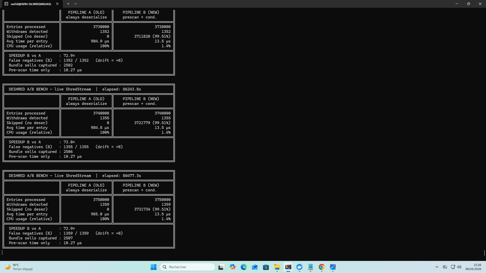
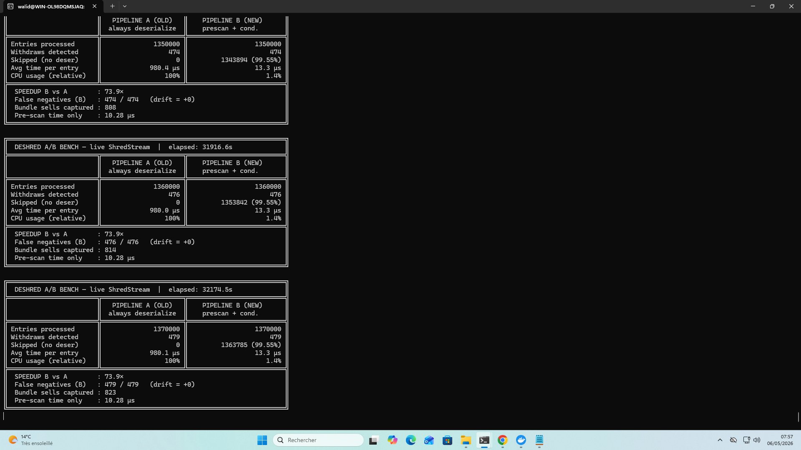
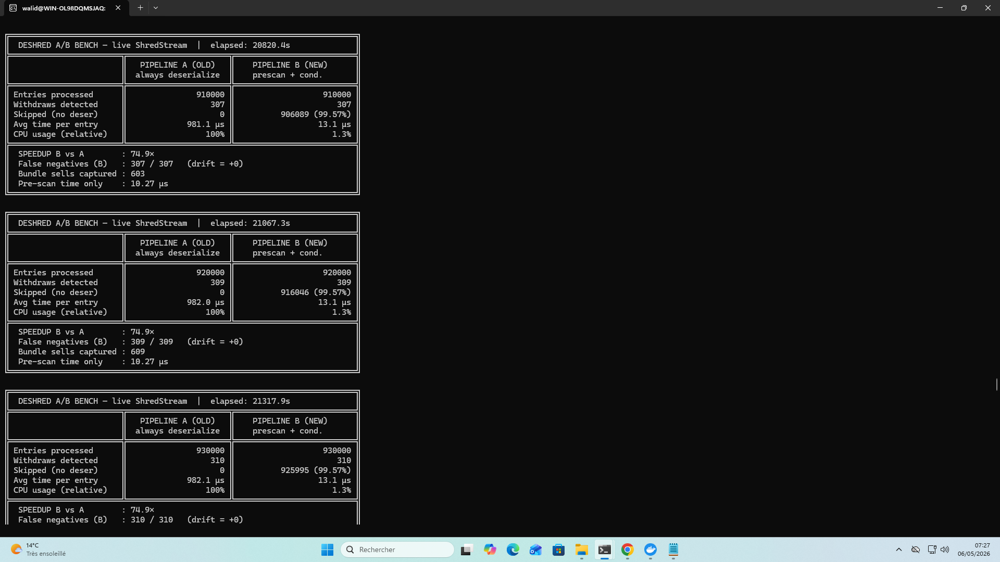
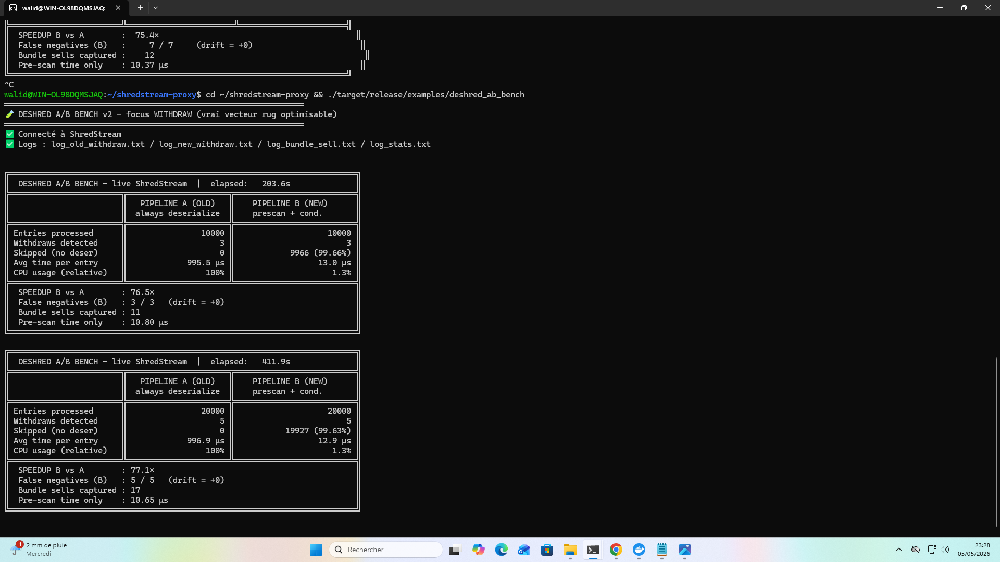
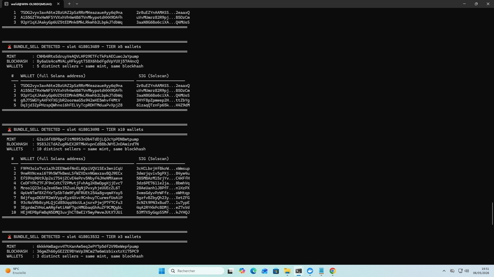
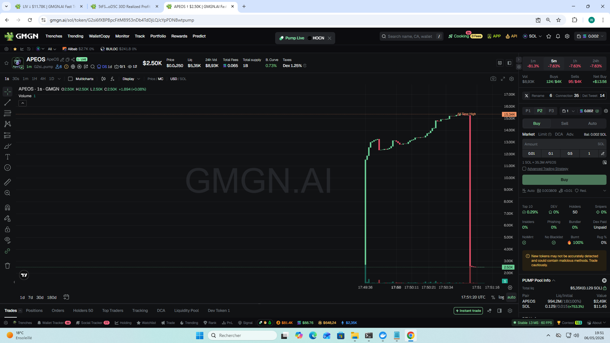
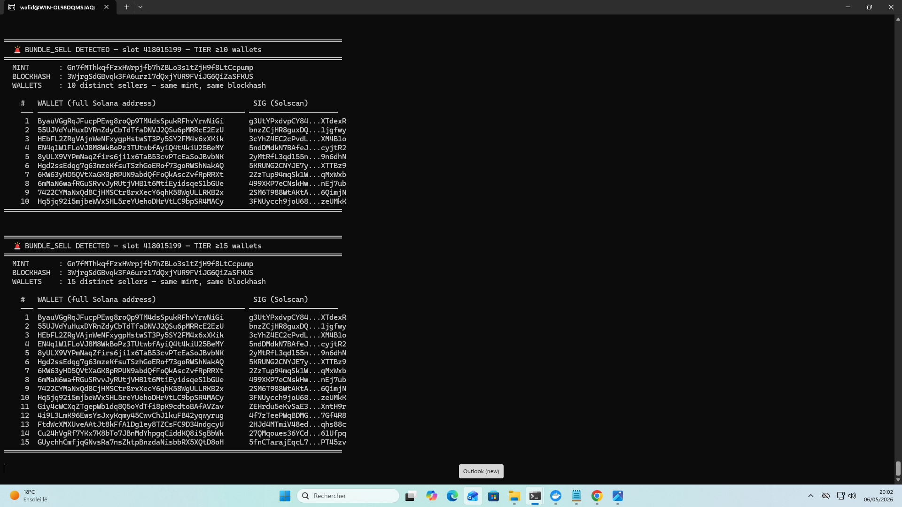
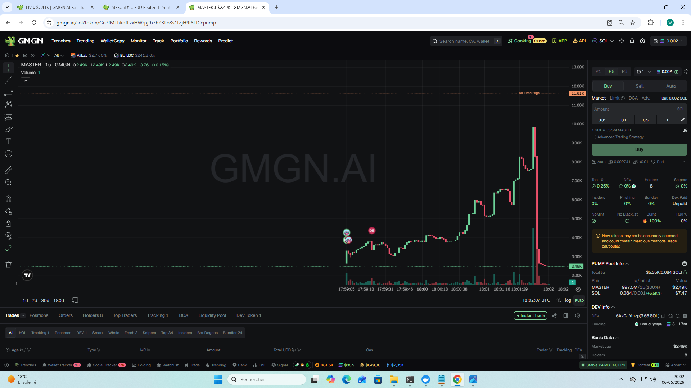

# Brain-Shield — Public Proof Pack

**A unified anti-rug shield for Solana memecoin traders, built on Jito ShredStream.**

> 💬 **JIP-Ideas thread** : [forum.jito.network/t/brain-shield-a-defensive-use-case-for-shredstream](https://forum.jito.network/t/brain-shield-a-defensive-use-case-for-shredstream-opt-in-trade-insurance-for-memecoin-holders/938) — community discussion ongoing.

Covers the 3 dominant rug vectors across pump.fun, BONK, LetsBonk, Believe,
Moonshot, Daos.fun, PumpSwap AMM and any future Solana memecoin launchpad.

> **24h continuous live run on the Solana ShredStream feed — 0 missed rugs out of 1,359 detected, 72.9× faster than the baseline pipeline.**

---

## The 3 rug vectors Brain-Shield addresses

| Layer | Rug vector | What it does | Status |
|---|---|---|---|
| **L1** | LP Withdrawal | Pool creator removes liquidity → price collapses to zero | **Proven** (17h live bench) |
| **L2** | Coordinated Dump | N wallets sell the same mint in the same slot/blockhash | Prototype running in same bench |
| **L3** | Cartel Operation | Coordinated wallets pump together, dump together | Detection logic ready (960 highly active cartels indexed) |

This proof pack focuses on **Layer 1** (the layer that is already production-validated).
Layers 2 and 3 are described in the project's full pitch document.

---

## Layer 1 — LP Withdrawal Detection

### TL;DR — 24h continuous live run, local hardware

| | Pipeline A (baseline) | Pipeline B (Brain-Shield) |
|---|---:|---:|
| Entries processed | 3 750 000 | 3 750 000 |
| Withdraws detected | 1 359 | 1 359 |
| False negatives | — | **0 / 1 359** |
| Avg per-entry time | 985.0 µs | **13.5 µs** |
| Relative CPU usage | 100% | **1.4%** |
| **Speedup** | — | **72.9×** |

- Live Solana ShredStream feed (test machine: WSL2 desktop — production
  numbers expected to improve on a dedicated Frankfurt bare metal server).
- **24h continuous run**, 3.75 million entries processed by **both**
  pipelines, no restart, no degradation.
- 18+ consecutive checkpoints, speedup variance ~6% (72.4× – 77.1×).
- 1 359 real on-chain withdrawals captured, every one matched on Solscan.

### Sample on-chain match
[5aFJw4rN…ftgrM](https://solscan.io/tx/5aFJw4rNWMrhUQmw1NzrduC6Fnvaiy8ZwXBx7MUxC6ZnUxyttdt2qEDygBoYdkuEB8K88fQ8C1a5VepgCrKftgrM)

### Stability across the 24h run — checkpoint trail

The detection speed stays flat from the first 10k entries to the final 3.75M — no warm-up artifact, no drift.

**Final checkpoint — 3.75M entries / 24h continuous run**

**Late-run checkpoint — 1.37M entries / 8h55**

**Mid-run checkpoint — 910k entries / 5h45**

**Early-run checkpoint — 10k → 50k entries**

→ Speedup variance over the full run : **72.4× – 77.1×** (~6%, structural).

---

## Layer 2 — Coordinated Dump Detection

The same bench process also runs a coordinated-dump heuristic on live
ShredStream data (3+ distinct wallets selling the same mint in the same
blockhash). Over the 24h run, **2 507 coordinated-dump events were
captured**, in addition to the 1 359 LP rugs — including multiple
**TIER ≥15** captures (15+ distinct wallets sharing the same blockhash
in a single block, mathematically impossible by chance).

See **`PITCH_L2.md`** for four detailed case studies with terminal
captures and matching GMGN price-collapse charts.

### Two illustrated cases

**Case A — TIER 10 (10 wallets sharing the same blockhash on the same mint)**

Brain-Shield terminal alert (the moment 10 distinct wallets were detected dumping `apeos` at the same blockhash) :

GMGN price chart at the same moment — the dump bundle is the vertical wick :

---

**Case B — TIER ≥15 (15+ wallets sharing the same blockhash, mathematically impossible by chance)**

Brain-Shield terminal alert :

GMGN price chart at the same moment :

→ The detection fires **as the dump bundle hits the slot**, not after the price has collapsed. Two more cases (`solmaxxing`, `party`) are in `PITCH_L2.md` and the `screenshots/` folder.

---

## Layer 3 — Cartel Operation Detection

Brain-Shield V0 (offline analysis) has already indexed **960 highly active cartels** of
coordinated wallets from historical Solana memecoin trade data, and
validated their predictive value on a hold-out set:

- **95% WR on 101 alerted migrations** (offline backtest).

Layer 3 ships the cartel database and the matching logic in the
ShredStream pipeline so cartels are detected **as they enter a token**,
not just after the fact.

Implementation details and the cartel database are part of the project's
private IP and will be shared with grant evaluators under appropriate
confidentiality.

---

## What's in this folder

| File | Purpose |
|---|---|
| `RESULTS.md` | Layer 1 — full numbers, 18+ checkpoint stability table, on-chain validation (24h run). |
| `PITCH_L2.md` | Layer 2 — coordinated-dump detection, four captured cases (with TIER ≥15) and GMGN charts. |
| `SAMPLES.md` | 10 representative L1 withdrawals with Solscan links for third-party verification. |
| `METHODOLOGY.md` | How the A/B benchmark is designed and why the result is irrefutable. |
| `screenshots/` | 12 raw L1 captures + 8 L2 captures (terminal + chart pairs). |

---

## Note on disclosure

This proof pack is intended for public distribution (Discord, Twitter,
grant applications). It contains **performance and correctness evidence
only** — no source code or implementation details of the optimization
strategy used by Pipeline B, no cartel-detection internals.

Implementation details and the full Rust harness will be shared with
grant evaluators under confidentiality arrangements.

---

Project : Brain-Shield — 3-layer anti-rug shield for Solana memecoin traders
Built with : Jito ShredStream
